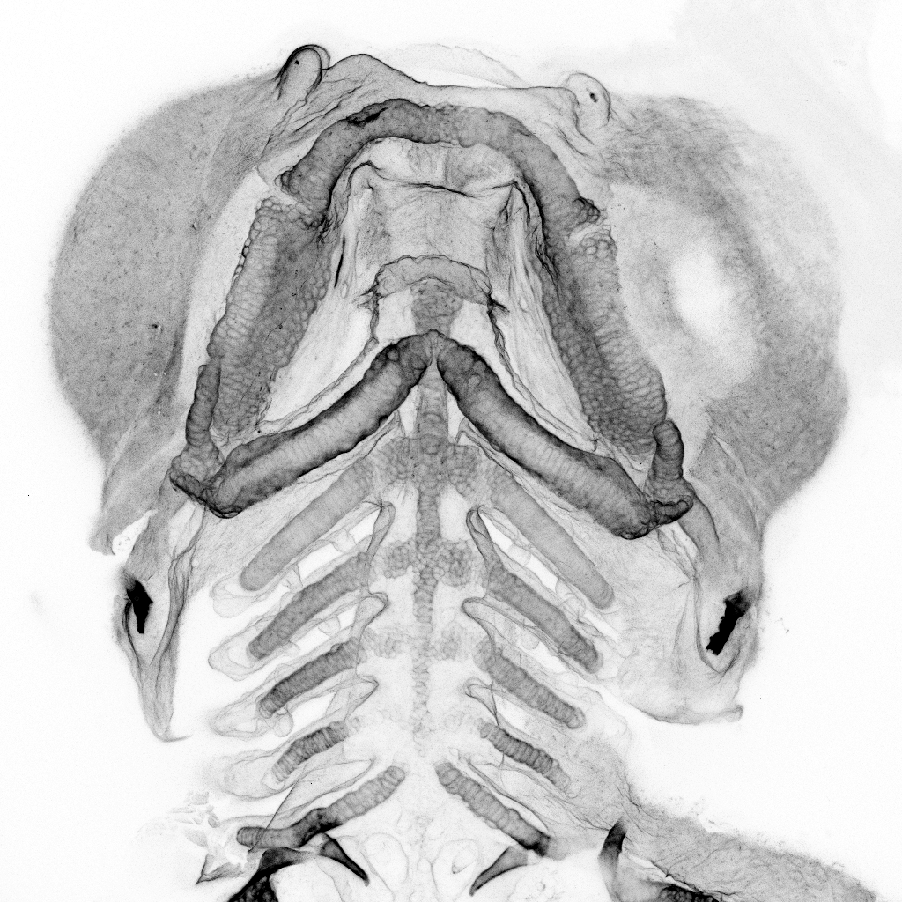

# Dorrity Lab

  
EMBL Heidelberg — Molecular Systems Biology

  <h2 class="hero-headline">Temporal robustness in development</h2>
  
We uncover the molecular and cellular sources of robustness in development — how embryos keep time across cells, temperatures, and species. 

[Research →](research.md){ .md-button }
[Publications →](publications.md){ .md-button }

<figure class="fig-frame" style="margin: 0; width: 100%;">
  <video autoplay muted loop playsinline style="width: 100%; border-radius: 2px;">
    <source src="assets/videos/arut-movie.mp4" type="video/mp4">
  </video>
  <figcaption class="fig-caption">
    M. Benton
    EMBL
  </figcaption>
</figure>

  
Selected publications

  

    2026
    

      
<a href="https://www.biorxiv.org/content/10.64898/2026.06.15.732302v1.abstract">Quantitative mapping of heterochrony to species-specific phenotypes</a>

      
Bourn JJ, Knoblich SA, Kneeshaw SJ, Benjaminsen J, Zilova L, Aulehla A, Saunders L, Wittbrodt J, Birney E, Dorrity MW

    

    bioRxiv
  

  

    2026
    

      
<a href="https://www.nature.com/articles/s41556-026-01954-4">Life-cycle trajectory inference links temperature-gated progenitors to reproductive fate</a>

      
Vaidya G, Lagodny E, Girish A, Mellado Fuentes AM, Ross E, Robb S, Mirkes K, Yavru D, Khan AUM, Tischer C, Dorrity MW, Vu HTK

    

    bioRxiv
  

  

    2023
    

      
<a href="https://doi.org/10.1016/j.cell.2023.10.013">Proteostasis governs differential temperature sensitivity across embryonic cell types</a>

      
Dorrity MW, Saunders LM, Duran M, Srivatsan SR, Barkan E, Jackson DL, … Trapnell C

    

    Cell
  

<figure class="fig-frame">
  
  <figcaption class="fig-caption">
    M. Lamprousi 
    Dorrity Lab / EMBL
  </figcaption>
</figure>