# People

  <a href="dorrity/">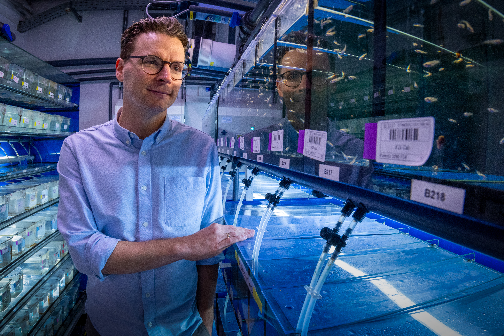</a>
  

    <h2 class="pi-hero-name">Michael Dorrity</h2>
    
Group Leader

    
As a Group Leader in the Molecular Systems Biology Unit at EMBL Heidelberg, I generate multi-scale representations of developmental processes in order to measure temporal shifts associated with deleterious or novel phenotypes. My group uses a combination of time-resolved single-cell genomics, biochemistry, and computational biology.

    

      <a href="dorrity/" class="pi-hero-link-btn">Bio</a>
      <a href="../assets/docs/dorrity_cv.pdf" class="pi-hero-link-btn">CV</a>
      <a href="https://scholar.google.com/citations?user=k8cKuy0AAAAJ&hl=en&oi=ao" class="pi-hero-link-btn">Scholar</a>
      <a href="mailto:michael.dorrity@embl.de" class="pi-hero-link-btn">Email</a>
    

  

---

<a href="kneeshaw/" class="person-face-card">
  

    
    

      
Sophie Kneeshaw

      
Lab Officer

    

  

</a>

<a href="bucao/" class="person-face-card">
  

    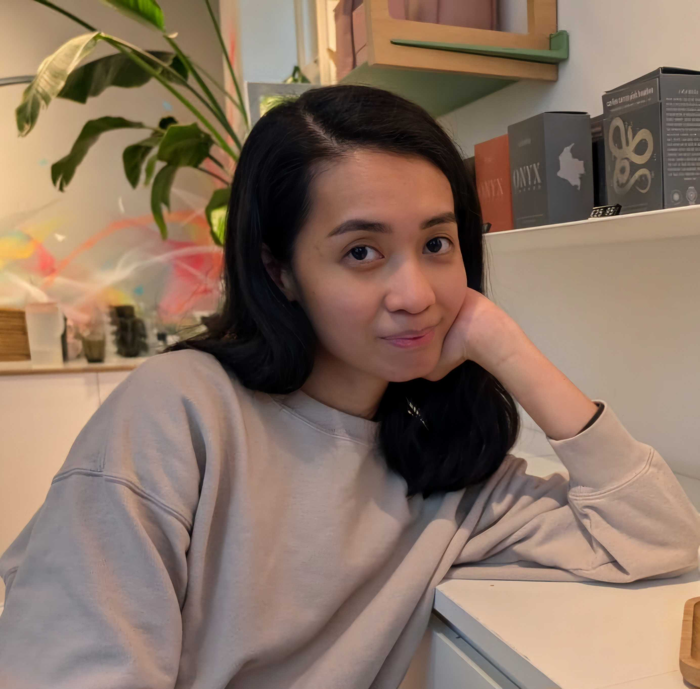
    

      
Christabel Bucao

      
Postdoc

    

  

</a>

<a href="welz/" class="person-face-card">
  

    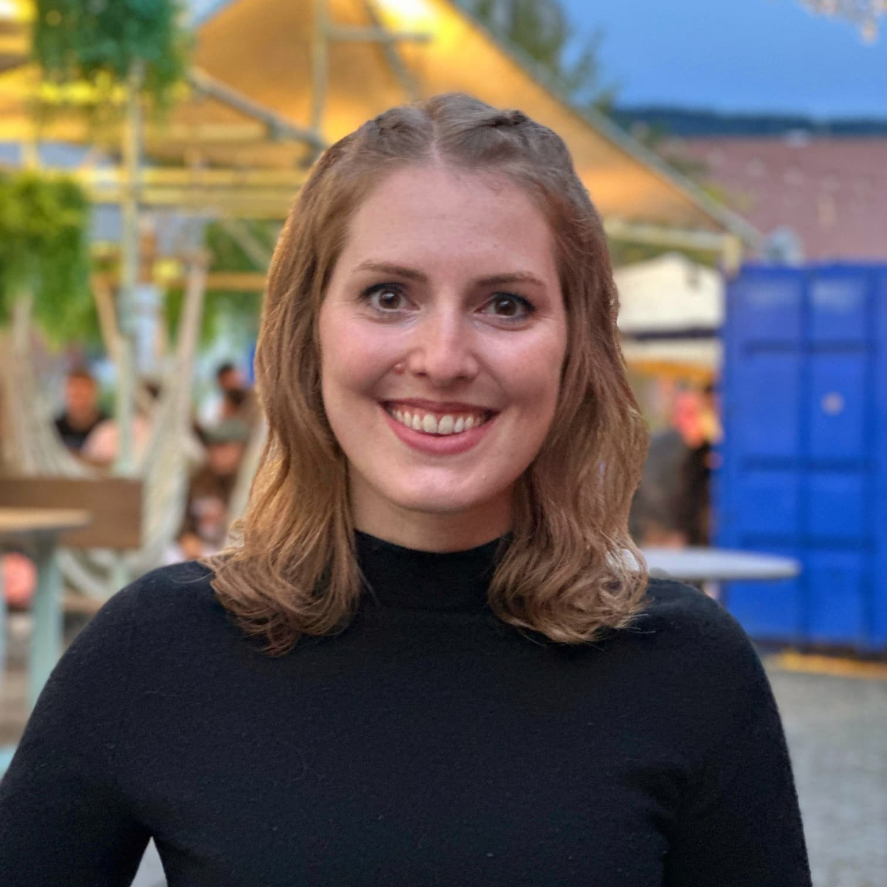
    

      
Bettina Welz

      
Postdoc

    

  

</a>

<a href="hernandez/" class="person-face-card">
  

    
    

      
Luis Hernandez-Huertas

      
Postdoc

    

  

</a>

<a href="perez/" class="person-face-card">
  

    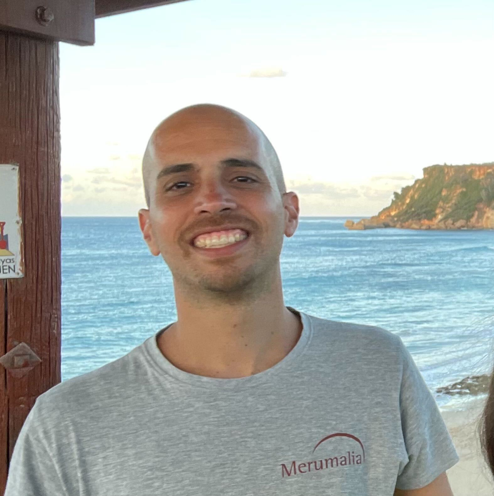
    

      
Julio Perez

      
Postdoc

    

  

</a>

<a href="benjaminsen/" class="person-face-card">
  

    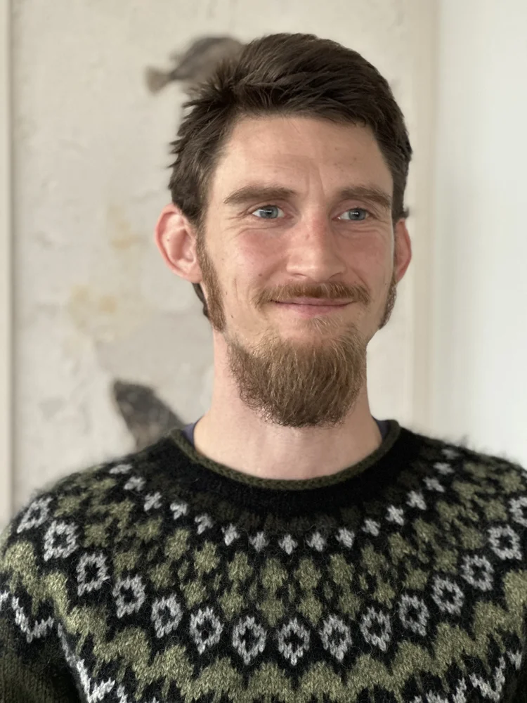
    

      
Joergen Benjaminsen

      
Postdoc (joint, Wittbrodt lab)

    

  

</a>

<a href="herrera/" class="person-face-card">
  

    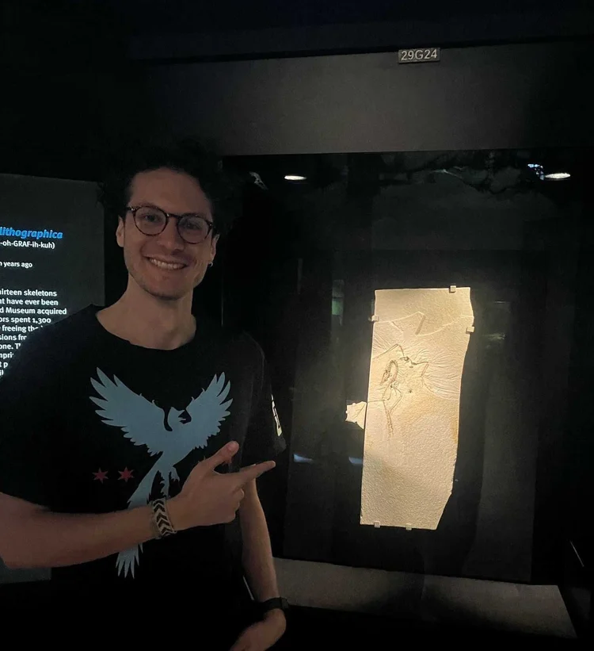
    

      
Santiago Herrera-Alvarez

      
Postdoc (joint, Crocker lab)

    

  

</a>

<a href="bourn/" class="person-face-card">
  

    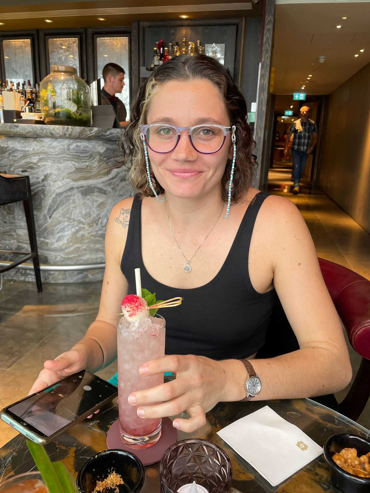
    

      
Jess Bourn

      
PhD Student

    

  

</a>

<a href="vaidya/" class="person-face-card">
  

    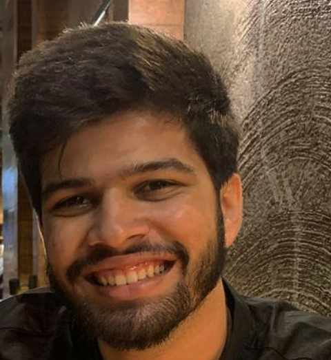
    

      
Gaurav Vaidya

      
PhD Student

    

  

</a>

<a href="petrasiunaite/" class="person-face-card">
  

    
    

      
Vesta Petrasiunaite

      
PhD Student

    

  

</a>

<a href="mayer/" class="person-face-card">
  

    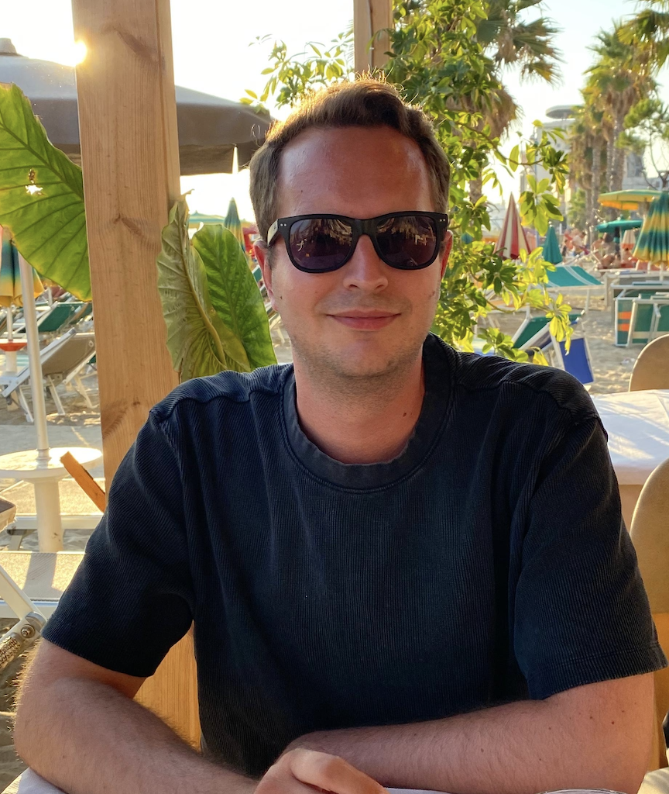
    

      
Marvin Mayer

      
PhD Student

    

  

</a>

<!--
<a href="hsing/" class="person-face-card">
  

    
    

      
Jeni Hsing

      
PhD Student

    

  

</a>

<a href="espinosa/" class="person-face-card">
  

    
    

      
Lot Hernandez Espinosa

      
PhD Student

    

  

</a>

 -->

<a href="seyda/" class="person-face-card">
  

    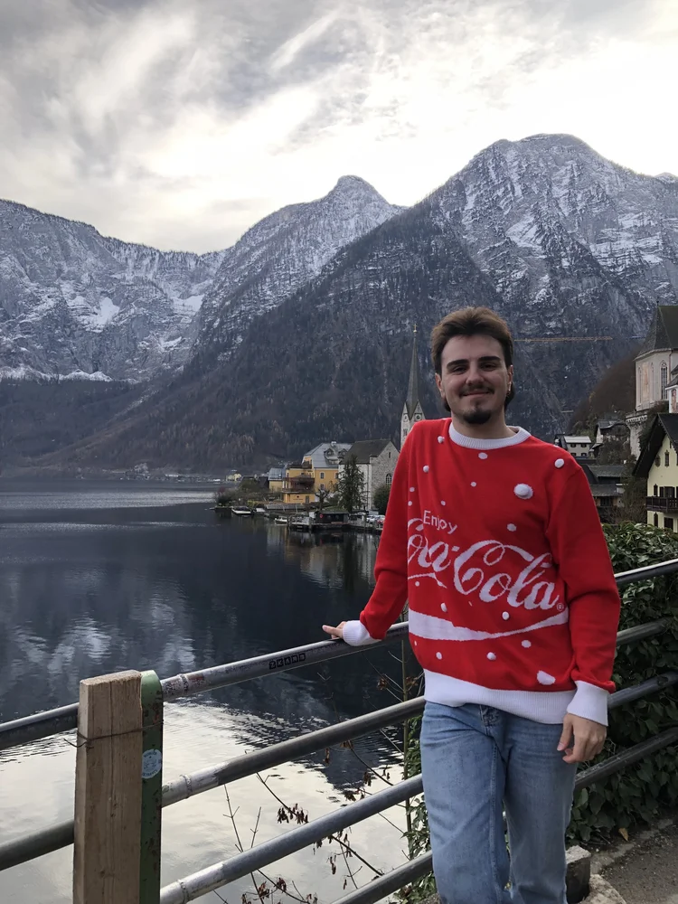
    

      
Cem Seyda

      
Scientific Trainee

    

  

</a>

<a href="kellas/" class="person-face-card">
  

    
    

      
Will Kellas

      
Research Intern

    

  

</a>

<!--
<a href="tarcsa/" class="person-face-card">
  

    
    

      
Virag Tarcsa

      
Masters Student

    

  

</a>
-->

<a href="purohit/" class="person-face-card">
  

    
    

      
Yagya Purohit

      
Masters Student

    

  

</a>

<a href="ishibashi/" class="person-face-card">
  

    
    

      
Ojiro Ishibashi

      
Research Intern

    

  

</a>

<a href="eila/" class="person-face-card">
  

    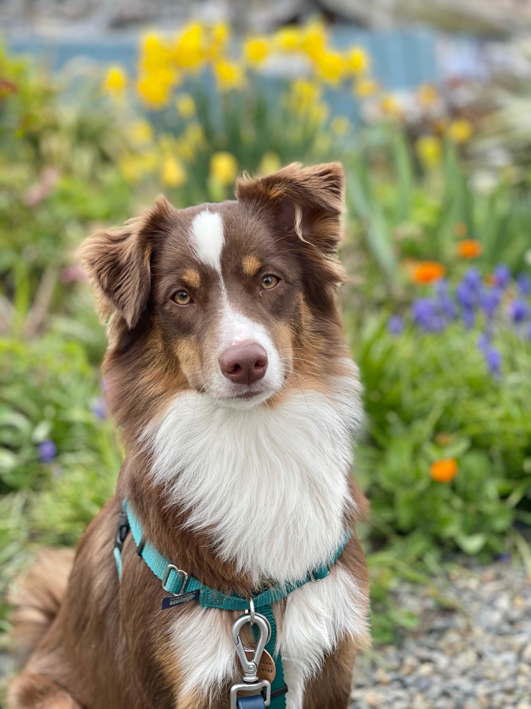
    

      
Eila

      
Lab Dog

    

  

</a>

---

## Join Us

We are always looking for talented and motivated researchers to join the lab.

- Postdocs should reach out directly with a CV and brief statement of proposed research.
- Prospective graduate students should apply through the [EMBL International PhD Program](https://www.embl.org/about/info/embl-international-phd-programme/)

---

## Alumni

**Mantha Lamprousi** — PhD Student -> now @Uni Freiburg  
**Eric Laudemann** — Masters Thesis Student -> now @EMBL-HD  
**Marie Becker** — Intern -> now @ETH-Zürich 
**Aishwarya Girish** — Intern -> now @Uni Heidelberg 
**Augustin Auvergne** — Intern -> now @Sanofi 
**Marjane Habibi** — Intern 
**Deep Patel** — Intern 
**Karishma Behera** — Intern

