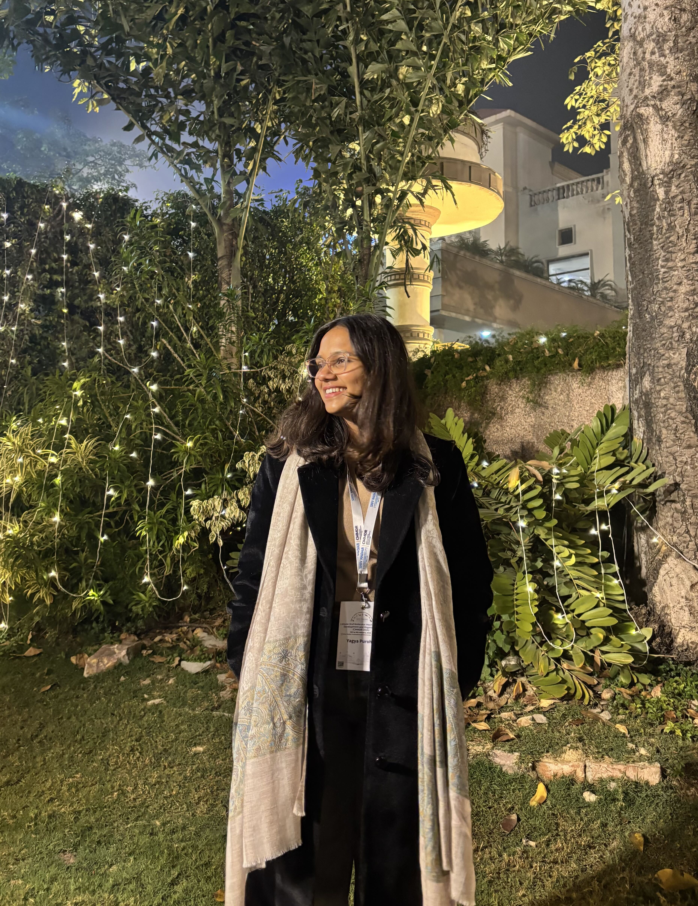

  
  

    <h1>Yagya Purohit</h1>
    
Masters Student

  

<nav class="person-profile-links">
  <a href="mailto:yagya.purohit@embl.de" class="person-profile-link">Email</a>
</nav>

I am currently working on a project to temporally sequence a cell’s transcriptome without destroying it. When I am off the clock, you can find me with a book, a coffee, dreaming about the ocean or shopping for my next vacation. Science aur Sahitya – that’s basically me.

