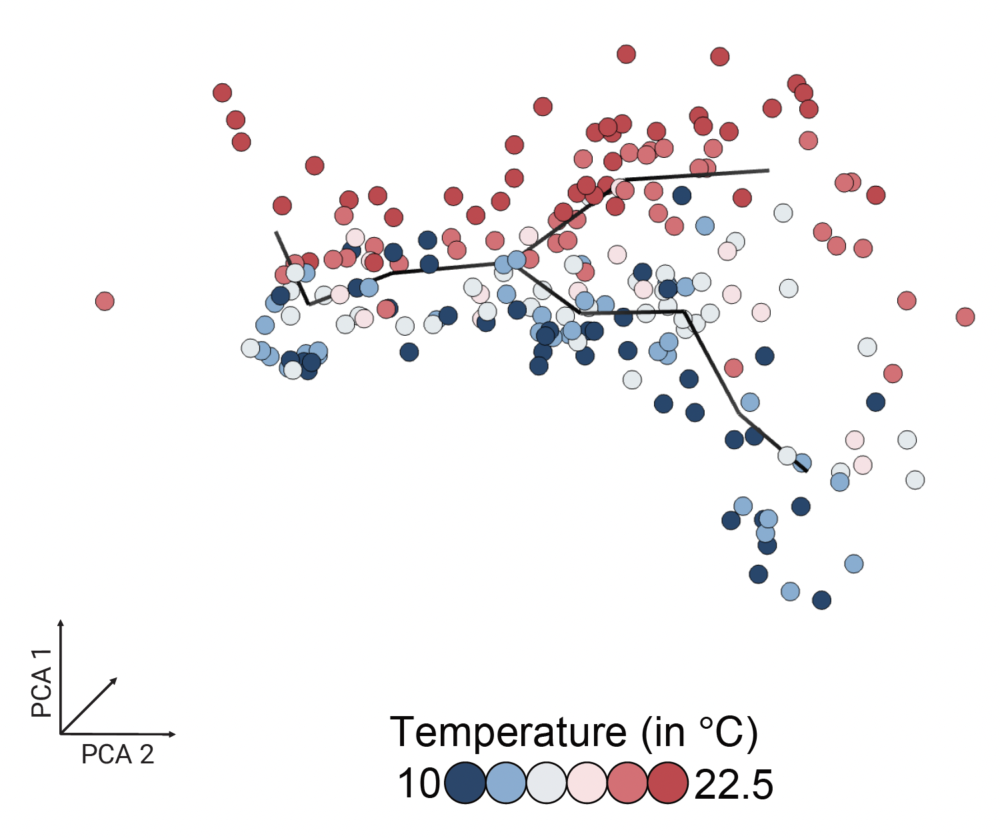
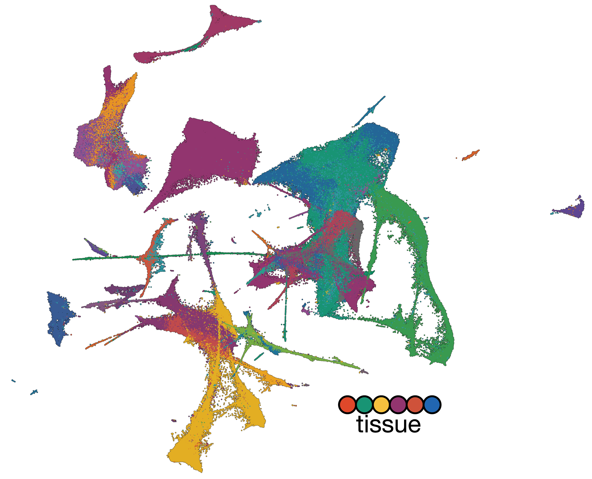
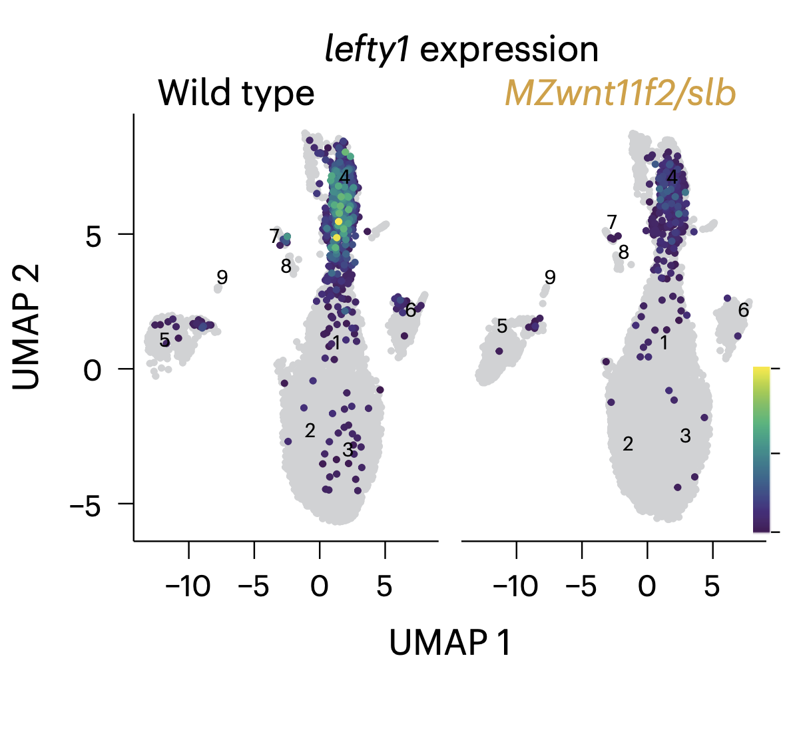
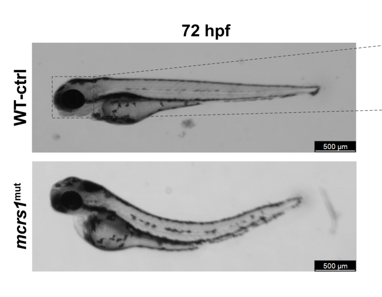
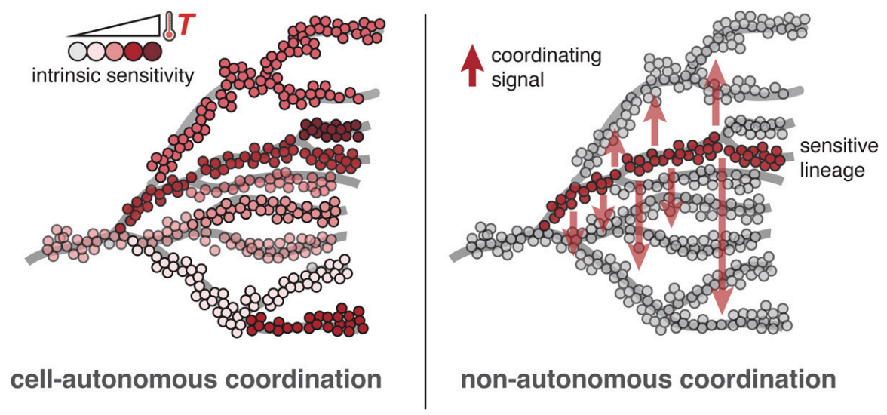
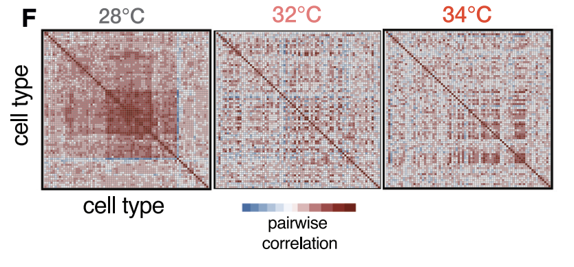
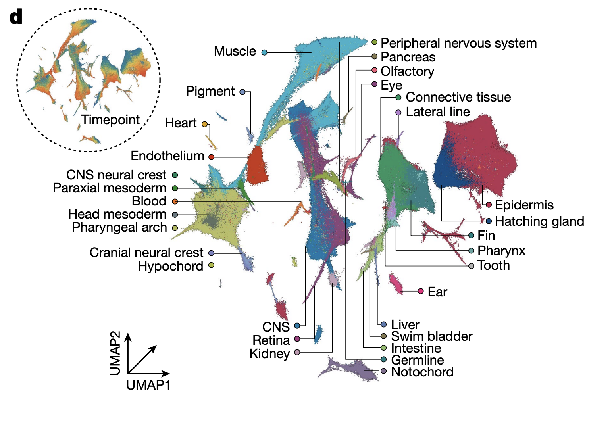

# Publications

2026

  
  

    <h3 class="paper-title">Life-cycle trajectory inference links temperature-gated progenitors to reproductive fate</h3>
    
Vaidya G, Lagodny E, Girish A, Mellado Fuentes AM, Ross E, Robb S, Mirkes K, Yavru D, Khan AUM, Tischer C, Dorrity MW†, Vu HTK†

    
bioRxiv. 2026.

    

      <a href="https://www.biorxiv.org/content/10.64898/2026.06.29.735214v1.abstract" class="paper-link">Preprint</a>
    

  

  
  

    <h3 class="paper-title">Quantitative mapping of heterochrony to species-specific phenotypes</h3>
    
Bourn JJ, Knoblich SA, Kneeshaw SJ, Benjaminsen J, Zilova L, Aulehla A, Saunders L, Wittbrodt J, Birney E, Dorrity MW

    
bioRxiv. 2026.

    

      <a href="https://www.biorxiv.org/content/10.64898/2026.06.15.732302v1.abstract" class="paper-link">Preprint</a>
    

  

  
  

    <h3 class="paper-title">Tissue rigidity phase transition shapes morphogen gradients</h3>
    
Autorino C, Khoromskaia D, Harari L, Floris E, Booth H, Pallares-Cartes C, Petrasiunaite V, Dorrity MW, Corominas-Murtra B, Hadjivasiliou Z, Petridou NI

    
Nature Cell Biology. 2026.

    

      <a href="https://www.nature.com/articles/s41556-026-01954-4" class="paper-link">Paper</a>
    

  

2025

  
  

    <h3 class="paper-title">High-throughput single-cell CRISPRi screens stratify neurodevelopmental functions of schizophrenia-associated genes</h3>
    
Yildiz U, Claringbould A, Marttinen M, Campos-Fornes V, Lamprousi M, Saraswat M, Saver M, Bunina D, Dorrity MW, Zaugg J, Noh KM

    
bioRxiv. 2025.

    

      <a href="https://www.biorxiv.org/content/10.1101/2025.06.13.659629v1.abstract" class="paper-link">Preprint</a>
    

  

2024

  
  

    <h3 class="paper-title">Degrees of freedom: temperature's influence on developmental rate</h3>
    
Bourn JJ, Dorrity MW

    
Current Opinion in Genetics & Development. 2024; 85:102155.

    

      <a href="https://doi.org/10.1016/j.gde.2024.102155" class="paper-link">Paper</a>
    

  

2023

  
  

    <h3 class="paper-title">Proteostasis governs differential temperature sensitivity across embryonic cell types</h3>
    
Dorrity MW†, Saunders LM, Duran M, Srivatsan SR, Barkan E, Jackson DL, ... Trapnell C†

    
Cell. 2023; 186(23):5015-5027.

    

      <a href="https://doi.org/10.1016/j.cell.2023.10.013" class="paper-link">Paper</a>
    

  

  
  

    <h3 class="paper-title">Embryo-scale reverse genetics at single-cell resolution</h3>
    
Saunders LM, Srivatsan SR, Duran M, Dorrity MW, Ewing B, Linbo TH, ... Trapnell C

    
Nature. 2023.

    

      <a href="https://doi.org/10.1038/s41586-023-06720-2" class="paper-link">Paper</a>
    

  

2022

  

    <h3 class="paper-title">Dynamic chromatin accessibility deploys heterotypic cis/trans-acting factors driving stomatal cell-fate commitment</h3>
    
Kim ED, Dorrity MW, Fitzgerald BA, Seo H, Sepuru KM, Queitsch C, Mitsuda N, Han SK, Torii KU

    
Nature Plants. 2022.

    

      <a href="https://doi.org/10.1038/s41477-022-01304-w" class="paper-link">Paper</a>
    

  

2021

  

    <h3 class="paper-title">The regulatory landscape of Arabidopsis thaliana roots at single-cell resolution</h3>
    
Dorrity MW, Alexandre C, Hamm M, Vigil A, Fields S, Queitsch C, Cuperus J

    
Nature Communications. 2021; 12(1):3334.

    

      <a href="https://doi.org/10.1038/s41467-021-23675-y" class="paper-link">Paper</a>
    

  

2020

  

    <h3 class="paper-title">Dimensionality reduction by UMAP to visualize physical and genetic interactions</h3>
    
Dorrity MW, Saunders LM, Queitsch C, Fields S, Trapnell C

    
Nature Communications. 2020; 11:1537.

    

      <a href="https://doi.org/10.1038/s41467-020-15351-4" class="paper-link">Paper</a>
    

  

  

    <h3 class="paper-title">Identification of plant enhancers and their constituent elements by STARR-seq in tobacco leaves</h3>
    
Jores T, Tonnies J, Dorrity MW, Cuperus JT, Fields S, Queitsch C

    
The Plant Cell. 2020; 32:2120-2131.

    

      <a href="https://doi.org/10.1105/tpc.20.00155" class="paper-link">Paper</a>
    

  

  

    <h3 class="paper-title">Binding and regulation of transcription by yeast Ste12 variants to drive mating and invasion phenotypes</h3>
    
Zhou W, Dorrity MW, Bubb KL, Queitsch C, Fields S

    
Genetics. 2020; 214(2):397-407.

    

      <a href="https://doi.org/10.1534/genetics.119.302929" class="paper-link">Paper</a>
    

  

  

    <h3 class="paper-title">Transcriptional re-wiring by mutation of the yeast Hsf1 oligomerization domain</h3>
    
Morton EA, Dorrity MW, Zhou W, Fields S, Queitsch C

    
bioRxiv. 2020.

    

      <a href="https://doi.org/10.1101/2020.05.23.112250" class="paper-link">Preprint</a>
    

  

2019

  

    <h3 class="paper-title">High-throughput identification of dominant negative polypeptides in yeast</h3>
    
Dorrity MW, Queitsch C, Fields S

    
Nature Methods. 2019; 16:413.

    

      <a href="https://doi.org/10.1038/s41592-019-0368-0" class="paper-link">Paper</a>
    

  

  

    <h3 class="paper-title">Dynamics of gene expression in single root cells of Arabidopsis thaliana</h3>
    
Jean-Baptiste K, McFaline-Figueroa JL, Alexandre CM, Dorrity MW, Saunders L, Bubb KL, Trapnell C, Fields S, Queitsch C, Cuperus JT

    
The Plant Cell. 2019; 31:993-1011.

    

      <a href="https://doi.org/10.1105/tpc.18.00785" class="paper-link">Paper</a>
    

  

2018

  

    <h3 class="paper-title">Preferences in a trait decision determined by transcription factor variants</h3>
    
Dorrity MW, Cuperus JT, Carlisle JA, Fields S, Queitsch C

    
Proceedings of the National Academy of Sciences. 2018; 115:E7997-E8006.

    

      <a href="https://doi.org/10.1073/pnas.1805882115" class="paper-link">Paper</a>
    

  

  

    <h3 class="paper-title">Profiling of accessible chromatin regions across multiple plant species and cell types reveals common gene regulatory principles and new control modules</h3>
    
Maher KA, Bajic M, Kajala K, Reynoso M, Pauluzzi G, West DA, Zumstein K, Woodhouse M, Bubb K, Dorrity MW, Queitsch C

    
The Plant Cell. 2018; 30:15-36.

    

      <a href="https://doi.org/10.1105/tpc.17.00581" class="paper-link">Paper</a>
    

  

2017

  

    <h3 class="paper-title">Complex relationships between chromatin accessibility, sequence divergence, and gene expression in Arabidopsis thaliana</h3>
    
Alexandre CM, Urton JR, Jean-Baptiste K, Huddleston J, Dorrity MW, Cuperus JT, Sullivan AM, Bemm F, Jolic D, Arsovski AA, Thompson A, Queitsch C

    
Molecular Biology and Evolution. 2017; 35:837-854.

    

      <a href="https://doi.org/10.1093/molbev/msx326" class="paper-link">Paper</a>
    

  

2013

  

    <h3 class="paper-title">Identification of novel loci regulating interspecific variation in root morphology and cellular development in tomato</h3>
    
Ron M, Dorrity MW, de Lucas M, Toal T, Hernandez RI, Little SA, Maloof JN, Kliebenstein DJ, Brady SM

    
Plant Physiology. 2013; 162:755-768.

    

      <a href="https://doi.org/10.1104/pp.113.217802" class="paper-link">Paper</a>
    

  

