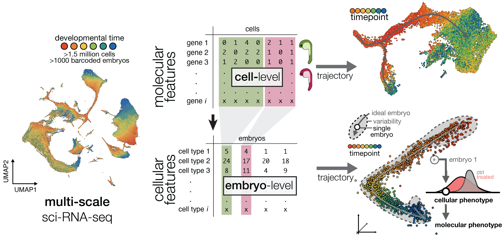
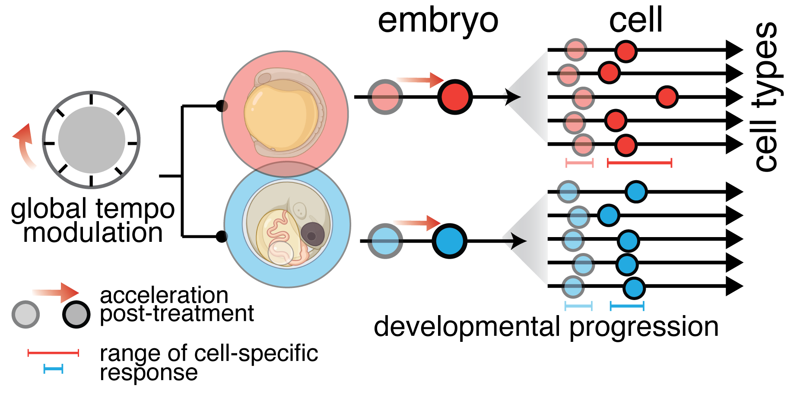
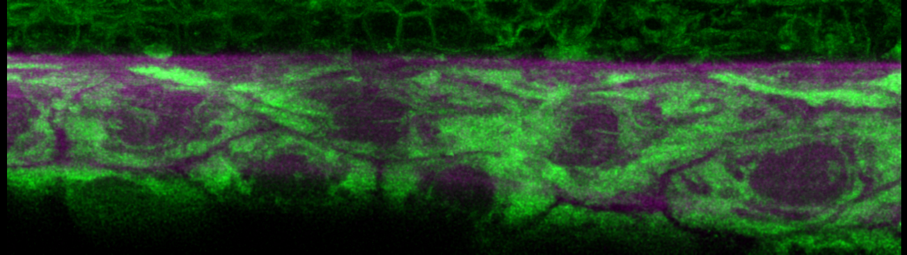
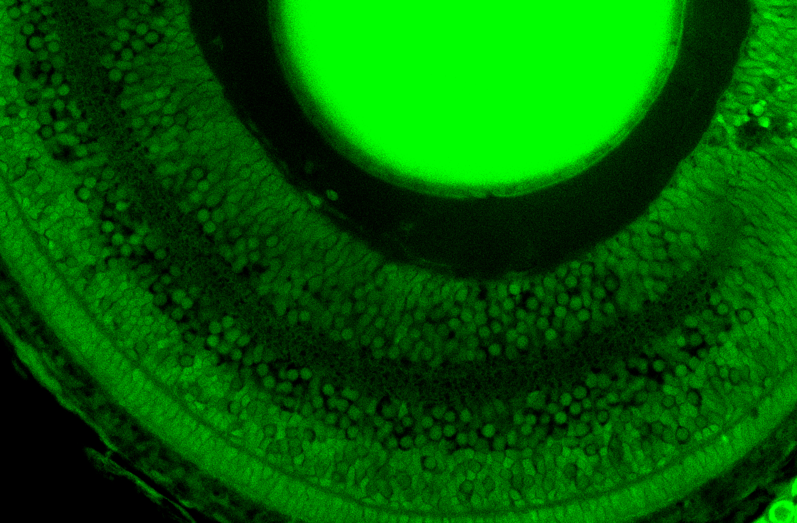
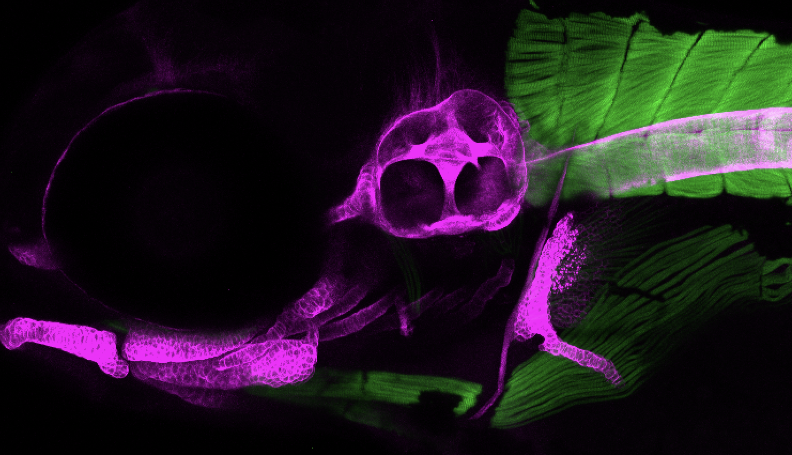
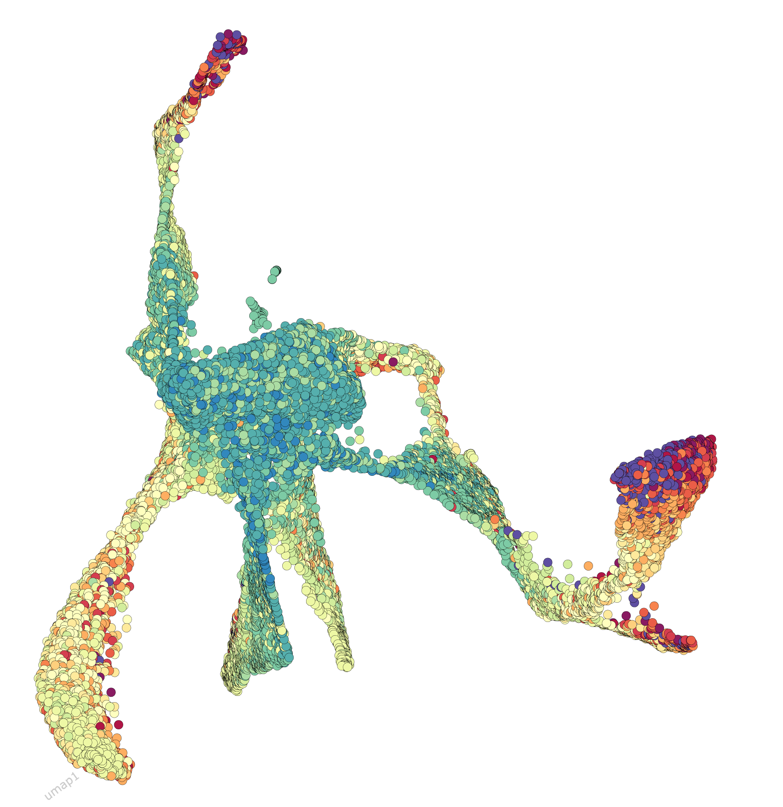
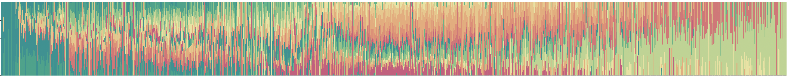

# Research
The mission of the Dorrity lab is to understand molecular and cellular sources of robustness in development. Using tools in single cell genomics, protein science, and computational biology, we seek to uncover general principles governing variability in developmental processes and better predict individual phenotype.

---

### Timing and Robustness

What sets the rate of development? Why do cells accelerate or slow their progression in response to the environment? How do cell lineages coordinate their temporal progression?

Progress in quantifying developmental timing has been enabled by single-cell transcriptomics, which allows large numbers of heterogeneously differentiating cells to be ordered into trajectories of developmental progression solely from gene expression data. We pioneered a new approach to study the temporal relationships among cells with multi-scale trajectory inference (<a href="https://www.biorxiv.org/content/10.64898/2026.06.15.732302v1.abstract">Bourn et al, 2026</a>), capturing progression cells within individual iterations of embryonic development to discover drivers of genetically-encoded or environmentally-induced asynchrony in development. With this approach, we will resolve molecular mechanisms underlying developmental timing differences across cells and discover how these mechanisms influence the evolution of developmental robustness across species like zebrafish and medaka.

---

### Temperature
Development is remarkably robust, but environmental stressors like temperature can diminish its ability to produce invariant whole-organism phenotype. That compromising development robustness with temperature produces stereotyped, rather than fully random, phenotypes suggest failure of specific structures, cell types, or molecular programs and that factors capable of sensing and responding to the environment must be embedded within the genetic networks required to specify cellular function.

We seek to understand why some cell types are more sensitive to temperature than others ([Bourn & Dorrity, 2024](https://www.sciencedirect.com/science/article/pii/S0959437X24000042), [Vaidya et al, 2026](https://www.biorxiv.org/content/10.64898/2026.06.29.735214v1.abstract)). Molecular mechanisms underlying temperature sensitivity contribute to overall developmental robustness and harnessing these mechanisms enables engineering or tuning of temperature sensitivity in developmental systems.

  
  
  

 
---
### Variability to Phenotype

How does variability propagate from molecular to cellular to organismal levels? We seek to move quantitative developmental biology forward by embracing and accounting for variability inherent in the program of development.

We aim to quantify reproducibility of development by building statistical models that (1) isolate stochastic variation in gene expression across cell types from both technical and biological sources; (2) account for temporal coordination across all cells in the embryo. By combining new experimental and computational methods, we can move toward predictive models of variability and robustness in development applicable across genetically diverse populations and species.

---

### Technology Development

Using combinatorial-indexing, we build tools that profile cellular properties beyond gene expression and chromatin state, enable measurement of individual-to-individual variability, and capture temporal dynamics of cells.

   

---

